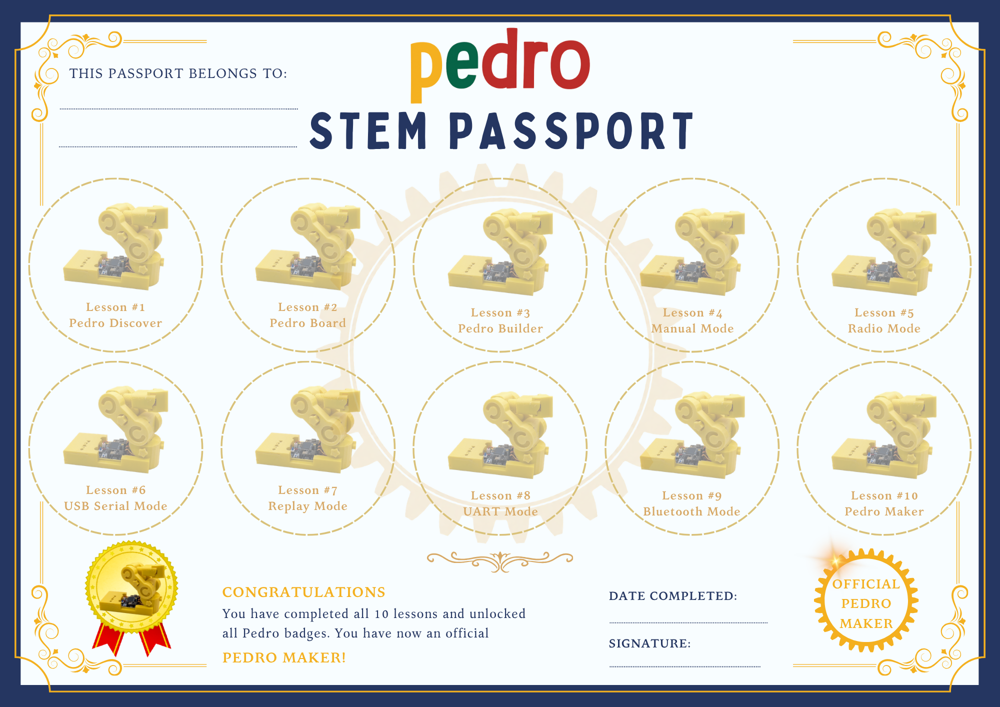

[![Contributors][contributors-shield]][contributors-url]
[![Forks][forks-shield]][forks-url]
[![Stargazers][stars-shield]][stars-url]
[![Pedrobot][Pedrobot-shield]][Pedrobot-url]

[Pedrobot-shield]: https://img.shields.io/badge/-Pedrobot-black.svg?style=for-the-badge&logo=Pedrobot&colorB=blue
[Pedrobot-url]: https://pedrobot.com

[contributors-shield]: https://img.shields.io/github/contributors/almtzr/Pedro.svg?style=for-the-badge&colorB=red
[contributors-url]: https://github.com/almtzr/Pedro/graphs/contributors

[forks-shield]: https://img.shields.io/github/forks/almtzr/Pedro.svg?style=for-the-badge&colorB=yellow
[forks-url]: https://github.com/almtzr/Pedro/network/members

[stars-shield]: https://img.shields.io/github/stars/almtzr/Pedro.svg?style=for-the-badge&colorB=orange
[stars-url]: https://github.com/almtzr/Pedro/stargazers

<br>

## Join the Pedro Community on Discord
<div align="left">
    <a href="https://discord.com/invite/TxkWNPU3ES">
       
    </a>
</div>

## 🚀 Pedro Project Repositories: 
Each Pedro repository serves a specific role in the ecosystem:

* 📂 [`Pedro 3D Files`](https://github.com/almtzr/Pedro): 3D printing resources — STL files and assembly instructions for building the Pedro robot chassis.
* 📂 [`Pedro Board`](https://github.com/almtzr/PedroBoard): Hardware design — Gerber files, schematics, and PCB layouts for the Pedro controller board.
* 📂 [`Pedro Robot`](https://github.com/almtzr/PedroRobot): Firmware — Arduino source code and library to program and control the Pedro robot.
* 📂 [`Pedro STEM`](https://github.com/almtzr/PedroSTEM): Education — STEM lessons, activities, and teaching material using the Pedro robot for schools.

# 📂 `Pedro Robot`

Pedro is a fully 3D-printed, open-source educational robot designed to make robotics accessible to everyone. Build, program, experiment, and discover robotics through engaging, hands-on STEM activities. 

With its modular design, tool-free assembly, and multiple control modes, Pedro provides a complete platform for exploring mechanics, electronics, programming, and robotic communication. It is designed for students, teachers, makers, and anyone curious about building and understanding robots.

Build it. Program it. Explore robotics.​

<div align="center">
     
     
</div>


<div align="center">
     
     
     
</div>

<br>

## 4. Contributing
We welcome contributions from the community! Here's how you can help:

1. **Fork the Repository**: Click the "Fork" button at the top right of this page.
2. **Clone Your Fork**: 
   ```
   git clone https://github.com/almtzr/Pedro.git
   ```
3. **Create a Branch**: 
   ```
   git checkout -b feature/your-feature-name
   ```
4. **Make Your Changes**: Add new features, fix bugs, or improve documentation.
5. **Commit and Push**: 
   ```
   git commit -m "Add your message here"
   git push origin feature/your-feature-name
   ```
6. **Submit a Pull Request**: Navigate to the original repository and submit a pull request.

---

